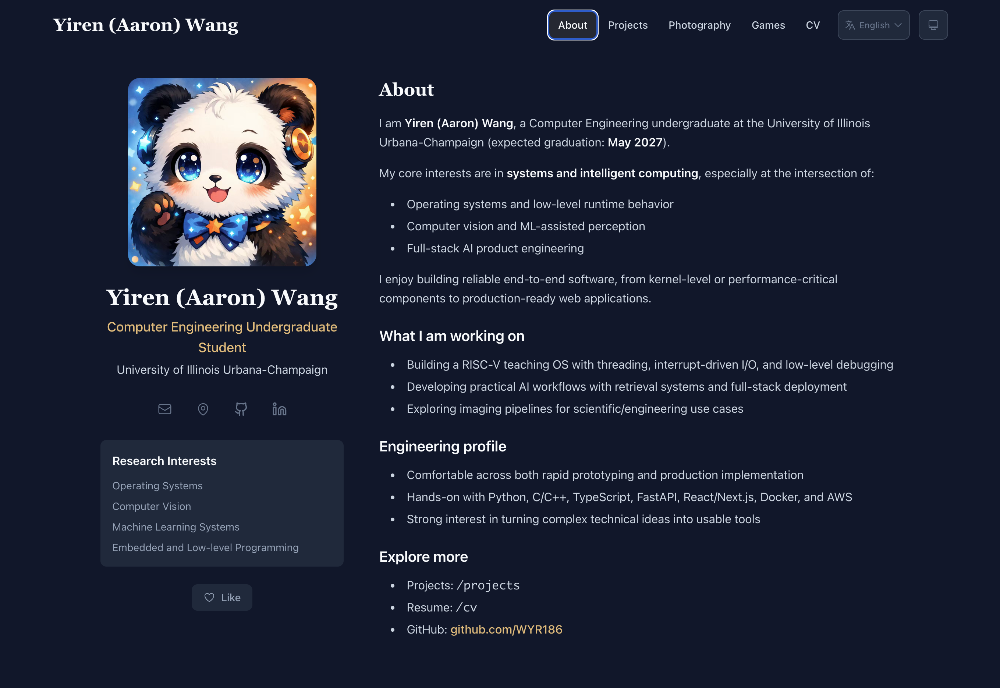

<div align="center">
  
</div>

# Yiren Wang 个人网站

[English](README.md) · **中文**

这是 **Yiren (Aaron) Wang** 的个人学术/工程主页（UIUC Computer Engineering），基于 Next.js 与内容配置驱动结构构建。



## 致谢与来源

本项目是在开源项目 **PRISM** 基础上的个人 Fork 与定制版本。  
原项目作者： [xyjoey](https://github.com/xyjoey/PRISM)  
当前仓库在尊重原作者工作与开源协议的前提下，进行了个人内容与交互层面的扩展。

## 这个版本的主要改动

- 替换为 Yiren Wang 个人内容（简介、项目、简历、摄影）
- 导航与页面结构调整（Projects / CV / Photography 等）
- 摄影画廊与全屏查看交互
- 主题系统扩展（新增 Illini 主题）
- 中英文双语内容维护（`content/` + `content_zh/`）

## 技术栈

- Next.js（App Router）
- TypeScript
- Tailwind CSS
- Framer Motion
- TOML / Markdown / BibTeX 内容管线

## 本地运行

```bash
npm install
npm run dev
```

浏览器访问 `http://localhost:3000`。

## 内容维护位置

主要目录：

- `content/`：默认语言内容
- `content_zh/`：中文内容
- `public/`：静态资源（头像、简历、摄影图片）

常改文件：

- `content/config.toml`：站点信息与导航
- `content/about.toml` + `content/bio.md`：About 页面
- `content/projects.toml`：项目展示
- `content/photography.toml`：摄影页
- `content/cv.md`：简历页

## 构建

```bash
npm run build
```

## 开源协议

本仓库遵循 MIT 协议，详见 [LICENSE](LICENSE)。
